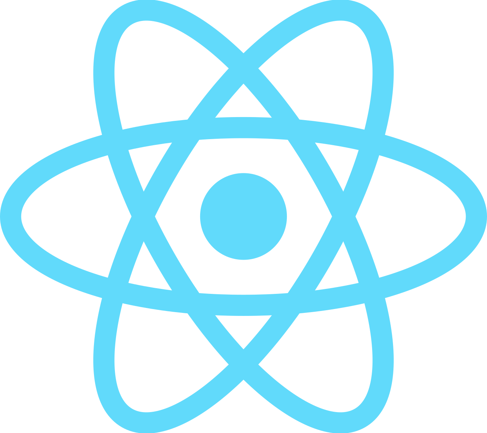
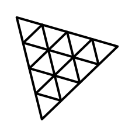
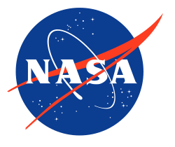

# NASA NeoW API Visualizer 🚀

>A 3D web app that fetches live near-Earth asteroid data of the day from NASA's NeoWs API and renders it in an interactive Three.js environment to visualize near Earth object's and distance.

## Live Demo: [Click me!](https://nasa-neow-api-visualizer.netlify.app/) 

## GIF Demo:


## Technologies Used:  
* ### **Frontend:**   React,  JavaScript ( Three.js / WebGL for 3D rendering),   HTML &   CSS
* ### **APIs:** NASA NeoWs API  
* ### **Configuration:** Environment variables and deployment via Netlify (to secure API keys)
* ### **Assets:** High-res equirectangular textures from NASA, SolarSystemScope, and Wikipedia. (linked at bottom)

## Notable Features:
* **Custom React-Three.js Bridge:** Bypassed wrapper libraries like R3F to build a native, high-performance ThreeJS engine. Uses React's useRef to maintain a persistent 3D instance while allowing React to manage DOM overlay states seamlessly.
* **Robust Memory Management:** Engineered a comprehensive garbage-collection pipeline (dispose()) that automatically purges WebGL contexts, geometries, and GPU textures when components unmount to eliminate memory leaks.
* **Smart API Data Caching:** Implemented local storage caching to minimize redundant API calls and prevent exceeding the API key request limit. `NasaAPI.js` runs a check to see if today's API data is cached before making a new request, ensuring efficient use of the API key and improving app performance.
* **To-Scale Distances:** Uses 1/1000km scale for the distance of objects to accurately represent how far away these asteroids are.
* **Realistic Earth Rendering:** Features an equirectangular projected Earth texture with accurate y-axis tilt and atmospheric cloud layers.
* **Immersive Starfield:** Features a custom-generated, evenly distributed background star system populated via unit coordinates.
* **Orbit & Zoom Controls:** Allows user to orbit an selected object, zoom in & out, and has slight dampening to have smooth deceleration of camera to enhance user experience. 
* **Dynamic Design for Mobile Users** The Asteroid modal becomes centered in the screen, the animation stops, text is smaller, and is transformed down on the Y-axis to ensure mobile users can still interact with the 3D scene while still seeing the info on their centered asteroid.


## Challenges & Learnings:
* **Bridging Declarative React with Imperative WebGL:** Trying to run a vanilla Three.js engine inside React without using wrapper libraries like react-three-fiber created lifecycle conflicts. If React re-rendered the UI, it would wipe out or duplicate the 3D scene.
  * *Solution:* I utilized React's useRef hook to act as a safe "box" (sceneManagerRef.current) that persists the Three.js engine across UI re-renders without triggering new renders. I also implemented a strict check inside useEffect to prevent React 18's Strict Mode from accidentally spinning up multiple simultaneous rendering engines.
* **GPU Memory Management & Garbage Collection:** I quickly learned that when a React component unmounts, the browser does not automatically clear WebGL geometries, materials, or textures from the GPU memory, leading to severe memory leaks.
    * *Solution:* I engineered a custom dispose() pipeline inside my SceneManager. When the React ThreeCanvas component unmounts, the useEffect cleanup function triggers this method to cancel the requestAnimationFrame loop, traverse the scene graph, and manually execute .dispose() on all Three.js geometries and materials before shutting down the WebGL context.
* **The Scale of Space is Too Big:** If I used true 1:1 scaling for everything, the asteroids would be completely invisible to the user. 
  * *Solution:* I kept the distances true-to-scale but created an `artificialVisualizingScaler` in my `constants.js` file. I scaled the Earth up 250x and the asteroids up 50,000x. The halos around the asteroids are the same size as the Earth, which really puts into perspective just how massive the Earth is compared to the asteroids!
* **Star Generation:** I initially tried generating the background stars using random XYZ coordinates with rejection sampling to get them to generate within a specific range. (specified in constants.js: 'STARS_INNER_BOUND' & 'STARS_OUTER_BOUND') 
  * *Solution Part 1:* I wanted to get rid of the inefficiency of rejection sampling so I fundamentally don't generate a star outside of my specified bounds. This led me to genenrate stars via the Spherical coordinates (basically 3d polar coords) to restrict generation within a certain distance fixed radius from the origin to save compute time. Generating stars with spherical coords led to a clustering bias around the z-axis (about the poles) due to the polar nature of the coordinate system.
  * *Solution Part 2:* In search of a solution to create an even random dispersion of stars about my scene and doesn't generate faulty candidates, I opted for Unite vectors. I generate a unit vector in a random direction, then scale that unit vector to be within a range of 'STARS_INNER_BOUND' & 'STARS_OUTER_BOUND'.
* **API Outages:** I originally planned to use NASA's JPL ephemeris generator tool for accurate asteroid positioning, but their service was down during development. 
  * **Solution:** I engineered a fallback system to randomize coordinate positions which utilizes unit vectors just like the Star generation but instead for asteroids using the NeoWs data so the app remained fully functional while waiting for JPL to come back online. 
* **Asteroid Modal Scope:** Engineered a callback function that propagates from the main `App` component through `ThreeCanvas.jsx` to `AsteroidManager.js`. This callback updates the state with the selected asteroid's data, enabling the `AsteroidModal.jsx` component to dynamically display detailed information about the chosen asteroid.


# Future Features:
* Allow user to hit a button to close and reopen modal Asteroid display.
* HUD component that renders user's XYZ position and current zoom level.
* Popup initially that allows user to specify date of query
  * today button if just want to see asteroids of today
* Integrate with NASA JPL API to enable accurate coordinate representation of asteroids with respect to Earth once API is back online.
  * Slider to go forward and back in time and estimate course of asteroids based off of Earth and Sun's gravitational pull?
  * moon?


## Run Locally

1. ### Clone repo:
   ```bash
   git clone https://github.com/twaltner251/NASA-NeoW-API-Visualizer
   ```
    

2. ### Use Nasa's dedicated demo key: 
    ```bash
    'DEMO_KEY' or get your own at: https://api.nasa.gov/ 
    ```

# Sources:
### NASA NeoW's API:
https://data.nasa.gov/dataset/asteroids-neows-api

### Equirectangular Projected Earth texture from NASA:
https://svs.gsfc.nasa.gov/3615/

### Equirectangular Projected Clouds texture from SolarSystemScope.com:
https://www.solarsystemscope.com/textures/

### Equirectangular Projected Asteroid texture from Wikipedia:
https://commons.wikimedia.org/wiki/File:Generic_Celestia_asteroid_texture.jpg
